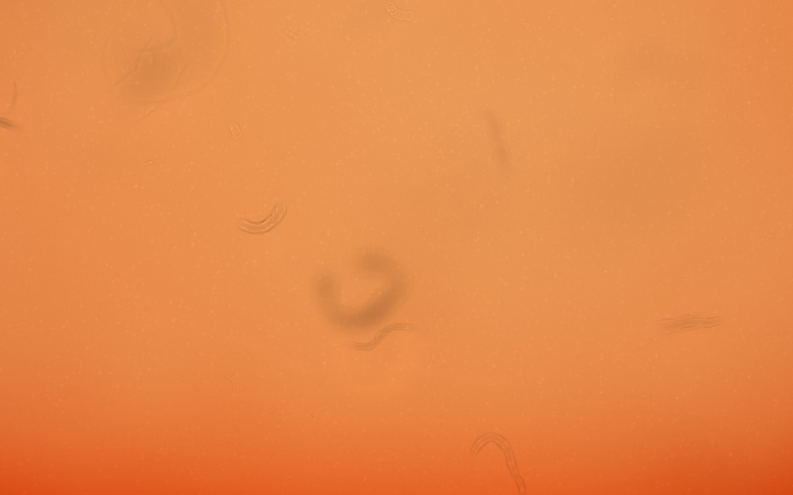
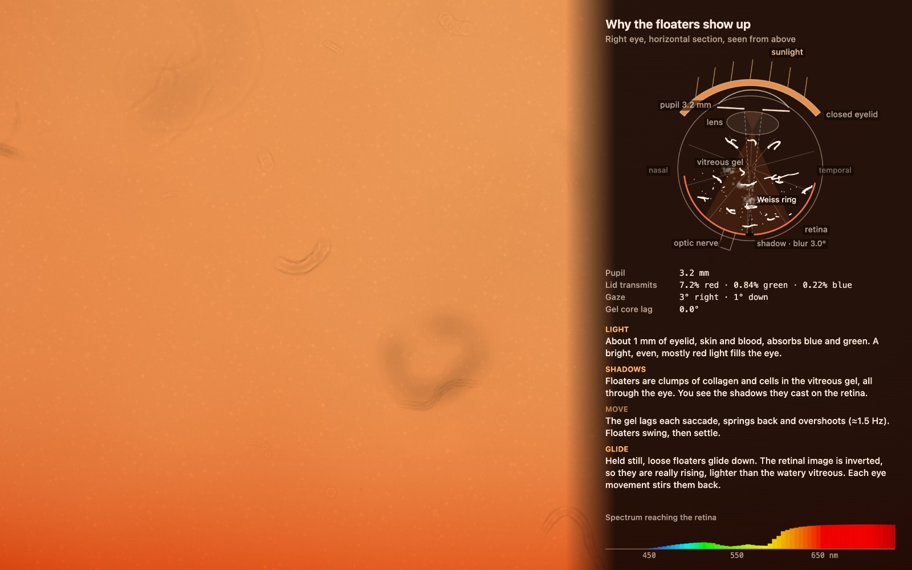

# Vitreous Floaters

**Close your eyes, face the summer sun, and watch the floaters.**
A physically based, real-time simulation of what one eye sees behind a sunlit eyelid: the warm glow, the drifting shadows of vitreous floaters, the wobble of the gel and the shimmer of the retina. It all runs from a single HTML file, with no libraries, images or other external assets. Everything is computed and drawn in code.

**▶ Live: [djui.github.io/vitreous-floaters](https://djui.github.io/vitreous-floaters/)**. Works on desktop and on phones, where you tilt the device to look around.



## What you are looking at

The inside of your eye is filled with the *vitreous*, a clear gel of water, collagen fibres and hyaluronan. With age the gel partly liquefies, and its collagen clumps into strands; cells and debris drift in it too. When it pulls away from the back of the eye (a *posterior vitreous detachment*), a ring of tissue that was attached around the optic nerve often floats free: the *Weiss ring*.

None of this glows. What you see are the **shadows** these clumps cast onto your retina. They are easiest to see against a bright, even background. Closing your eyes in sunshine makes a perfect one: the eyelid turns into a glowing red-orange screen right in front of the eye.

The simulation follows the light from the sun through the eyelid, the pupil and the vitreous to the retina. It then runs the retinal image through a simple model of adaptation and perception.

## Controls

| Action | Desktop | Phone / tablet |
| --- | --- | --- |
| Move your eyes | Move the pointer, or the arrow keys | Tilt the device, or drag |
| Squeeze the eyelids | Scroll, <kbd>1</kbd>–<kbd>5</kbd>, <kbd>+</kbd> / <kbd>−</kbd> | Pinch |
| Squeeze hard | Hold the mouse button or <kbd>Space</kbd> | Press and hold |
| Look straight ahead | <kbd>0</kbd> or <kbd>C</kbd> | Two-finger tap (also recenters the tilt) |
| Show how it works | <kbd>D</kbd> | Double-tap |
| Generate a new set of floaters | <kbd>N</kbd> | – |
| Show the controls again | <kbd>H</kbd> | – |

Tilt steering needs a secure page (HTTPS or `localhost`). On iPhone and iPad, the first tap asks for permission to use the motion sensors. Tilt the right edge down to look right, and raise the top edge to look up.

## Things to try

- **Hold still.** Loose floaters glide down across your view. Every eye movement stirs them back, and the glide starts over.
- **Flick your eyes sideways and stop.** The gel lags behind the eye wall, then springs back and overshoots. The floaters swing and settle about a second later.
- **Stare at one floater without moving.** It slowly fades as the retina adapts to the stationary shadow (Troxler fading). Move and it pops back.
- **Squeeze slowly, then hard.** The glow darkens from orange to deep red. The pupil widens, so the shadows blur and fade. At full pressure the eyes roll upward (Bell's phenomenon), and pressure phosphenes swirl in.
- **Let go of a hard squeeze.** A bright, yellowish flash follows while the dilated pupil catches up and the cones re-adapt.
- **Press <kbd>D</kbd>.** A live cross-section shows the eyelid, pupil, lens, the bending gel and a shadow cone from the pupil through the Weiss ring to the retina. Notes next to it explain whatever is happening right now.



## How it works

### Light through the eyelid

- **Spectrum.** Light is modelled from 400 to 730 nm in 5 nm steps. Sunlight and skylight are approximated by a 5600 K blackbody.
- **Eyelid optics.** The eyelid is a 0.9 mm turbid tissue slab, treated with diffusion theory: `T(λ) ≈ 0.13·exp(−μ_eff·d)`, where `μ_eff = √(3·μa·(μa + μs′))`.
  - Absorption `μa` comes from 3 % blood (oxy- and deoxyhaemoglobin at 85 % saturation, using Prahl's extinction data), melanin and baseline tissue.
  - Scattering is `μs′ = 2.4·(λ/500 nm)^−1.3 mm⁻¹`.
  - A gently closed lid passes about **7 % of red, 0.8 % of green and 0.2 % of blue** light. That matches measured eyelid transmittance and explains the orange-red glow.
- **Squeezing** multiplies the optical path by up to about 4× through thicker, bunched tissue and skin folds. It also raises the lid margin and shades the lid.
- **The glow is not uniform.** The eye rotates underneath the lid, so different patches of lid sit in front of the pupil. Forward scattering brightens the direction of the sun, and the lid margin and brow darken the edges of the view.
- **Heartbeat.** Blood volume pulses at 64 bpm, the photoplethysmography signal, which makes a faint pulse in the glow.
- **Colour.** The spectrum is converted to cone signals via the CIE 1931 colour-matching functions (Wyman–Sloan–Shirley fit) and the Hunt–Pointer–Estévez matrix. The lens and cornea absorb a little blue.

### Shadows on the retina

- **Geometry.** The schematic eye uses these distances: exit pupil to fovea 20.3 mm, nodal point to fovea 16.7 mm, vitreous cavity radius 11 mm.
- **Floaters as scatterers.** Each floater is built from many tiny scatterers. There are 63 floaters and about 4,500 scatterers, spread over the whole visual field and through the full depth of the gel.
  - Collagen strands, often in loose bundles.
  - Strings of cells ("muscae volitantes").
  - Single dots.
  - Faint membranes.
  - A Weiss ring near the visual axis.
- **Blur.** Light reaches each point of the retina from the whole pupil. The shadow of a point is therefore a small copy of the pupil, with radius `b = ½·p·d / (distance from pupil to floater)`, where `p` is the pupil diameter and `d` the floater's distance from the retina. Floaters close to the retina are crisp; deep ones are broad, faint disks.
- **Phase contrast.** Most floaters are nearly transparent. They bend light rather than block it. This refraction is modelled with the transport-of-intensity equation, `I = I₀·(1 − (d·M/k)·∇²(K_b ∗ φ))`, blurred by the pupil kernel `K_b` and softened by Fresnel diffraction. It produces the bright cores and dark edges typical of floaters near the retina.
- **GPU rendering.** Every scatterer is drawn as an additive splat of an analytic (disk ⊗ Gaussian) kernel and its Laplacian.

### A gel that lags and wobbles

- **Gel model.** The vitreous is a viscoelastic (Kelvin–Voigt) sphere. Each spherical shell turns rigidly by an angle χ(r, t) that obeys `χ_tt = (c² + ν·∂t)·r⁻⁴·∂r(r⁴·∂r χ)`, with no slip at the eye wall.
  - The model is solved on 28 shells at 400 Hz, for horizontal and vertical rotation separately.
  - Parameters: shear-wave speed c = 25 mm/s (G ≈ 0.6 Pa) and ν = 60 mm²/s (η ≈ 0.06 Pa·s). These describe a partly liquefied adult vitreous: the first mode is about **1.6 Hz**, with a damping ratio of about 0.5.
  - The gel's core lags more than its rim, so floaters also bend a little as they move.
- **Tethers.** Each floater hangs on its own damped tether to the surrounding gel. The detached Weiss ring swings the most.
- **Saccades.**
  - Durations follow the main sequence (21 ms + 2.2 ms per degree), with minimum-jerk velocity profiles.
  - Large saccades undershoot and are followed by a corrective saccade.
  - The eyes also drift slightly between saccades.
  - Squeezing hard rolls the eyes up by up to 14° (Bell's phenomenon).

### Why floaters glide down

Many people see floaters sink slowly down through their view once the eye stops moving. The retinal image is upside down, so a shadow that glides **down** belongs to a floater that is **rising** inside the eye. Buoyancy (being slightly lighter than the watery, liquefied vitreous) and slow convection are the usual explanations.

Here, loose floaters rise at 0.15–0.8 mm/s until their tethers tighten, after 1.5–4.5 mm. Every eye rotation stirs them back toward their resting place.

### Pupil, retina and perception

- **Pupil.**
  - The pupil follows the eyelid's luminance with a Moon–Spencer-style formula, `D = 5.8 − 3.3·tanh(0.45·log₁₀(L/2))` mm. Red light drives the pupil only weakly, so `L` is weighted down.
  - Dynamics: constriction takes about 0.45 s and dilation about 1.7 s, plus a slow pupil wobble (hippus).
  - The light-gathering area is weighted for the Stiles–Crawford effect.
  - A wider pupil makes the view brighter but the shadows softer.
- **Adaptation.** Cone-specific global adaptation runs on fast (0.12 s) and slow (6 s) time scales. A slower local adaptation map makes stationary shadows fade and leaves faint afterimages.
- **Sparkle.** Photon and neural noise show up as faint, blurry specks that flicker briefly, plus a gentle shimmer. Their strength scales like shot noise, `1/√light`, so they grow as the lids squeeze tighter.
- **Pressure phosphenes** appear above about 60 % lid pressure.
- **Display.** A per-channel tone curve compresses the bright glow, turning the brightest orange a little yellow, as the Bezold–Brücke hue shift does in real vision. Floater shadows are then applied as *Weber* contrast, so the display keeps the contrast your eye would actually see.

### Rendering

WebGL 2 with half-float render targets and four passes each frame:

1. Floater shadows are drawn as additive splats.
2. Retinal light is computed per pixel, in cone space.
3. A quarter-resolution local adaptation map is updated.
4. Perception and tone mapping produce the screen image.

A 2D canvas on top draws the hints, the lid-pressure gauge and the cross-section explainer. The screen shows the visual field in an equidistant projection, with the shorter side spanning ±28°.

## Run it locally

It is one file. Open `index.html` in a browser that supports WebGL 2, or serve the folder:

```bash
python3 -m http.server 8000
```

Then visit <http://localhost:8000>. Tilt steering on a phone needs HTTPS. The [live site](https://djui.github.io/vitreous-floaters/) is served over HTTPS, and every [release](https://github.com/djui/vitreous-floaters/releases) includes the standalone file.

## Limits and simplifications

- The parameters come from published ranges, not from one person's eye. That includes gel stiffness, eyelid optics, floater density and buoyancy.
- It simulates one eye, the right eye. With both eyes closed you would see both eyes' floaters overlaid.
- Why floaters appear to drift down is still debated. The buoyant rise here is one plausible, physically consistent explanation.
- The pressure phosphenes are stylised, and the photon and neural noise is a perceptual model rather than a photon-by-photon simulation.
- No screen can show a bright, saturated orange at full brightness. The glow is tone-mapped, while the shadows keep their physical contrast.

**A health note:** this project is a visualisation, not medical advice. A sudden shower of new floaters, flashes of light, or a shadow or curtain over part of your vision can signal a retinal tear or detachment. These need an eye doctor the same day. And never look at the sun with your eyes open.

## Credits

- **Concept, direction and field notes:** Uwe Dauernheim ([@djui](https://github.com/djui)). Several parts of the model come from his own observations: the downward glide, floaters spread across the whole field, and the shimmering background.
- **Implementation:** written with [Claude](https://www.anthropic.com/claude) (Anthropic) in [Claude Code](https://claude.com/claude-code).

### Science the model builds on

- White, H. E. & Levatin, P. (1962). "Floaters" in the eye. *Scientific American* 206(6).
- Sebag, J. (2020). Vitreous and vision degrading myodesopsia. *Progress in Retinal and Eye Research* 79, 100847.
- Prahl, S. (1999). [Optical absorption of hemoglobin](https://omlc.org/spectra/hemoglobin/). Oregon Medical Laser Center.
- Jacques, S. L. (2013). Optical properties of biological tissues: a review. *Physics in Medicine & Biology* 58(11), R37–R61.
- Ando, K. & Kripke, D. F. (1996). Light attenuation by the human eyelid. *Biological Psychiatry* 39(1), 22–25.
- Bierman, A., Figueiro, M. G. & Rea, M. S. (2011). Measuring and predicting eyelid spectral transmittance. *Journal of Biomedical Optics* 16(6), 067011.
- Teague, M. R. (1983). Deterministic phase retrieval: a Green's function solution. *Journal of the Optical Society of America* 73(11), 1434–1441.
- Meskauskas, J., Repetto, R. & Siggers, J. H. (2011). Oscillatory motion of a viscoelastic fluid within a spherical cavity. *Journal of Fluid Mechanics* 685, 1–22.
- David, T., Smye, S., Dabbs, T. & James, T. (1998). A model for the fluid motion of vitreous humour of the human eye during saccadic movement. *Physics in Medicine & Biology* 43(6), 1385–1399.
- Bahill, A. T., Clark, M. R. & Stark, L. (1975). The main sequence, a tool for studying human eye movements. *Mathematical Biosciences* 24(3–4), 191–204.
- Flash, T. & Hogan, N. (1985). The coordination of arm movements: an experimentally confirmed mathematical model. *Journal of Neuroscience* 5(7), 1688–1703.
- Stiles, W. S. & Crawford, B. H. (1933). The luminous efficiency of rays entering the eye pupil at different points. *Proceedings of the Royal Society B* 112, 428–450.
- Moon, P. & Spencer, D. E. (1944). On the Stiles–Crawford effect. *Journal of the Optical Society of America* 34(6), 319–329.
- Watson, A. B. & Yellott, J. I. (2012). A unified formula for light-adapted pupil size. *Journal of Vision* 12(10):12.
- Allen, J. (2007). Photoplethysmography and its application in clinical physiological measurement. *Physiological Measurement* 28(3), R1–R39.
- Hunt, R. W. G. (2004). *The Reproduction of Colour*, 6th ed. Wiley. This is the source of the Hunt–Pointer–Estévez cone matrix.
- Wyman, C., Sloan, P.-P. & Shirley, P. (2013). Simple analytic approximations to the CIE XYZ color matching functions. *Journal of Computer Graphics Techniques* 2(2), 1–11.

### Code techniques

- PCG3D hash: Jarzynski, M. & Olano, M. (2020). Hash functions for GPU rendering. *Journal of Computer Graphics Techniques* 9(3), 21–38.
- Error-function approximation: Abramowitz, M. & Stegun, I. A. (1964). *Handbook of Mathematical Functions*, formula 7.1.26.
- `mulberry32` pseudo-random generator by Tommy Ettinger.

### On the direction floaters drift

- [Direction of Floater Movement](https://groups.google.com/g/sci.med.vision/c/vgdBjtbBF2E), sci.med.vision
- [In-depth observations on eye floaters: a challenge to ophthalmology](https://www.sensitiveskinmagazine.com/in-depth-observations-on-eye-floaters-a-challenge-to-ophthalmology/), Sensitive Skin Magazine

## License

[MIT](LICENSE) © 2026 Uwe Dauernheim
